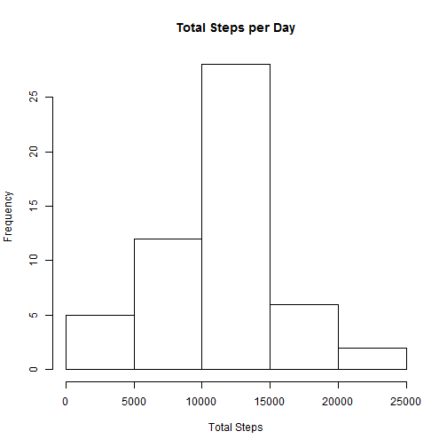
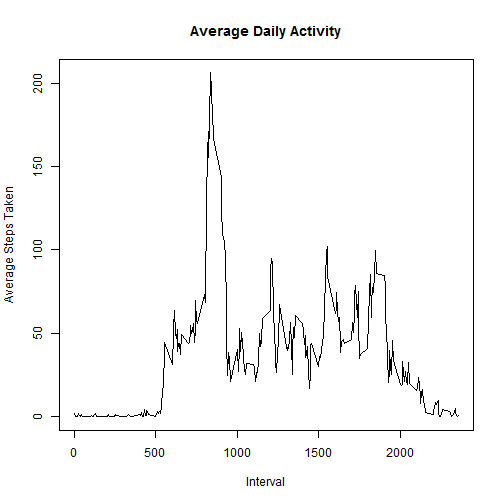
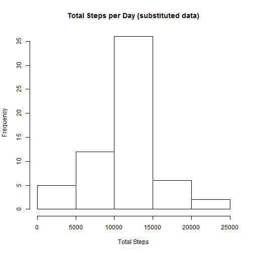
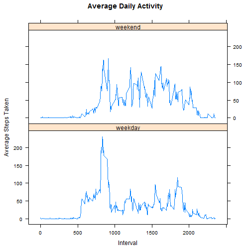

### Reproducible Research: Peer Assessment 1


#### A. Loading and preprocessing the data

##### 1. Load data


```r
activity <- read.csv("activity.csv")
```

##### 2. Format Date values


```r
activity$date <- strptime(activity$date, 
                          format="%Y-%m-%d")
```


#### B. What is mean total number of steps taken per day?

##### 1. Calculate Total Steps for each Day


```r
steps_per_day <- aggregate(activity$steps,
                     by=list(as.character(activity$date)),
                     FUN=sum)
```


```r
names(steps_per_day) <- c("Date", "Total_Steps")
```

##### 2. Histogram of Total Steps per day


```r
hist(steps_per_day$Total_Steps,
           main = 'Total Steps per Day',
           xlab = 'Total Steps')
```

 

##### 3. Calculate Mean and Median steps per day, excluding NA's


```r
mean(steps_per_day$Total_Steps, na.rm=TRUE)
```

```
## [1] 10766
```


```r
median(steps_per_day$Total_Steps, na.rm=TRUE)
```

```
## [1] 10765
```

From the above output, the Mean steps = 10,766
and the Median steps = 10,765

#### C. What is the average daily activity pattern?

##### 1. Average steps taken in each 5-minute interval, across all days, excluding NA's


```r
steps_5min <- aggregate(activity$steps,
                        by=list(activity$interval),
                        FUN=mean, na.rm=TRUE)
```


```r
names(steps_5min) <- c("Interval", "Steps")
```

##### 2. Time Series plot of steps in each 5-minute interval, averaged across all days, excluding NA's


```r
plot(steps_5min$Interval,
     steps_5min$Steps,
     main = 'Average Daily Activity',
     type = "l",
     xlab = "Interval",
     ylab = 'Average Steps Taken')
```

 


##### 3. Find 5-minute interval with maximum number of steps, averaged across all days


```r
steps_5min[steps_5min$Steps == max(steps_5min$Steps),]
```

```
##     Interval Steps
## 104      835 206.2
```

From the above output, the 5-minute interval with maximum number of steps is 835 (8:35-8:40 AM) with average steps = 206.2

#### D. Imputing missing values

##### 1. Calculate and report the total number of missing values 


```r
summary(activity$steps)
```

```
##    Min. 1st Qu.  Median    Mean 3rd Qu.    Max.    NA's 
##     0.0     0.0     0.0    37.4    12.0   806.0    2304
```

From the above output, the number of missing values = 2,304

##### 2.  Strategy for filling in missing values: if a 5-minute interval has a missing number of steps, substitute the corresponding 5-minute interval mean number of steps


```r
sub <- lapply(activity[is.na(activity$steps),3], 
              function(x)            
              steps_5min[steps_5min$Interval %in% x, 2])
```


```r
sub <- do.call("rbind", sub)
```

##### 3. Create new activity dataset with replaced NA values


```r
activity_sub <- activity
```


```r
activity_sub[is.na(activity_sub$steps),1] <- sub
```

##### 4. Calculate Total Steps for each Day for new dataset


```r
steps_per_day_sub <- aggregate(activity_sub$steps,
                     by=list(as.character(activity_sub$date)),
                     FUN=sum)
```


```r
names(steps_per_day_sub) <- c("Date", "Total_Steps")
```

##### 5. Histogram of Total Steps per day


```r
hist(steps_per_day_sub$Total_Steps,
           main = 'Total Steps per Day (substituted data)',
           xlab = 'Total Steps')
```

 

##### 6. Calculate Mean and Median steps per day


```r
mean(steps_per_day_sub$Total_Steps)
```

```
## [1] 10766
```


```r
median(steps_per_day_sub$Total_Steps)
```

```
## [1] 10766
```

The mean seems unchanged from the first part of the assignment (10,766).
The median is slightly changed, and is now equal to the mean.
The impact of imputing missing data on the estimates
of the total daily number of steps seems minimal.

#### E. Are there differences in activity patterns between weekdays and weekends?

##### 1. Add "Day of Week" factor variable to the substituted activity data:


```r
activity_sub$Day <- weekdays(activity_sub[,2])
```


```r
activity_sub$Day_of_Week[activity_sub$Day %in% c("Saturday","Sunday")] <- "weekend"
```


```r
activity_sub$Day_of_Week[!(activity_sub$Day %in% c("Saturday","Sunday"))] <- "weekday"
```


```r
activity_sub$Day_of_Week <- as.factor(activity_sub$Day_of_Week)
```

##### 2. Average steps taken in each 5-minute interval, by weekday/weekend


```r
steps_5min_day <- aggregate(activity_sub$steps,
                 by=list(activity_sub$interval,activity_sub$Day_of_Week),
                 FUN=mean)
```


```r
names(steps_5min_day) <- c("Interval", "Day", "Steps")
```

##### 3. Plot time series for steps in each 5min interval, for weekdays and weekends


```r
library(lattice)
```


```r
xyplot(steps_5min_day$Steps ~ 
       steps_5min_day$Interval | steps_5min_day$Day,
       layout = c(1,2),
       main = 'Average Daily Activity',
       type = "l",
       xlab = "Interval",
       ylab = "Average Steps Taken",)
```

 

       
       
